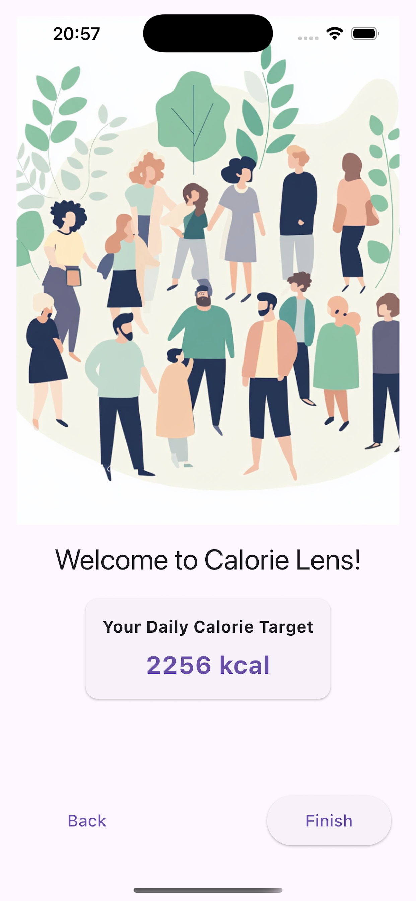
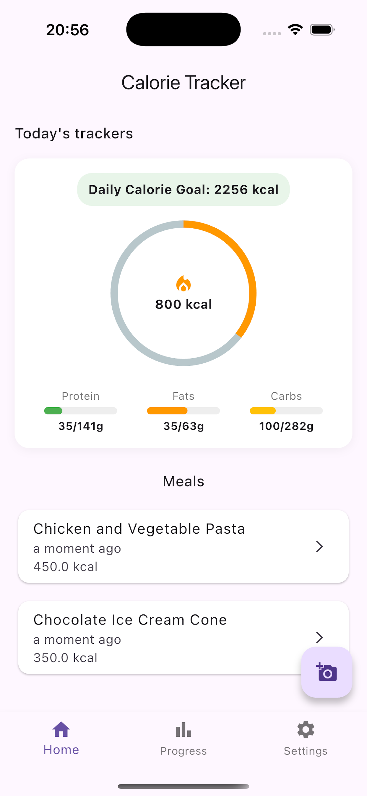
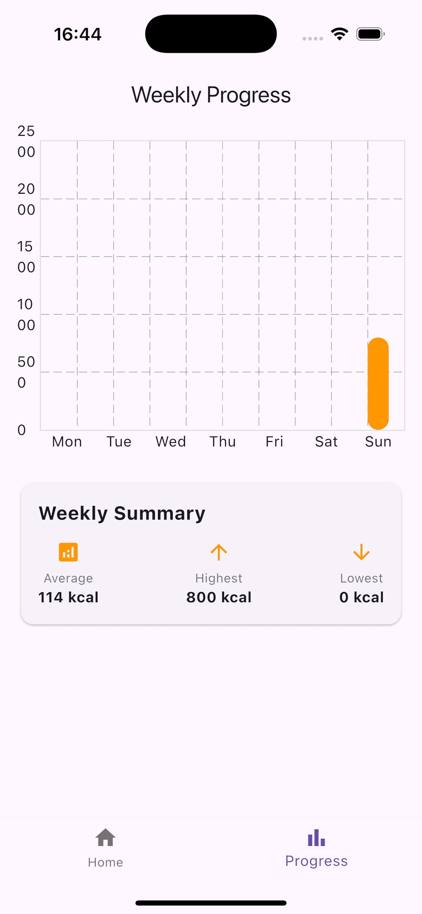
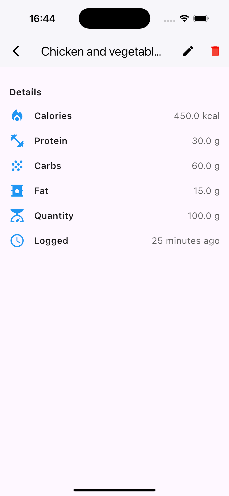

# Calorie Detector App

Welcome to the **Calorie Detector App**! This Flutter app uses Google Gemini AI to analyze food images and provide detailed nutritional information, including calorie count, protein, carbs, and fat content. With its user-friendly design and seamless AI integration, this app helps you track your meals and maintain your health goals effortlessly.

---

## Screenshots
| Welcome Screen | Main Screen |
|:---:|:---:|
|  |  |

| Progress Screen | Edit Screen |
|:---:|:---:|
|  |  |

## Features

1. **Onboarding Screen**:
   - Introduces users to the app's functionality.
   - Provides a quick walkthrough of how to use the app.

2. **Tracker Screen**:
   - Capture or upload food images to analyze nutritional details.
   - View AI-generated insights for each detected food item.

3. **Progress Screen**:
   - Monitor your daily, weekly, or monthly calorie intake.
   - Visualize progress with charts and summaries.

4. **Settings Screen**:
   - Customize your preferences, like daily calorie goals.
   - Manage account details and app configurations.

---


## วิธีการรันโปรเจกต์ (How to Run the Project)

### ข้อกำหนดเบื้องต้น (Prerequisites)
1. ติดตั้ง [Flutter](https://flutter.dev/docs/get-started/install) และตั้งค่า environment ให้เรียบร้อย
2. โคลนโปรเจกต์นี้และเข้าไปที่โฟลเดอร์โปรเจกต์

### การตั้งค่า Environment
1. คัดลอกไฟล์ `.env.example` ไปเป็น `.env` ที่ root ของโปรเจกต์
2. ใส่ Google Gemini AI API key ของคุณในไฟล์ `.env` เช่น
   ```env
   GOOGLE_AI_API_KEY=your_google_gemini_api_key_here
   ```
> **หมายเหตุ:** `.env` จะไม่ถูกเก็บใน version control เพื่อความปลอดภัยของ key
3. ตรวจสอบให้แน่ใจว่าได้ตั้งค่า permission สำหรับกล้องและแกลเลอรี่ในแต่ละ platform แล้ว

### วิธีรันแอป (Running the App)
1. ติดตั้ง dependencies:
   ```bash
   flutter pub get
   ```
2. รันแอป (เลือก platform ได้ เช่น web, android, ios, windows, macos):
   ```bash
   flutter run -d <platform>
   ```
   ตัวอย่างเช่น รันบน Edge (web):
   ```bash
   flutter run -d edge
   ```

---

## สถาปัตยกรรมที่ใช้ (Architecture Overview)

### ภาษาไทย
โปรเจกต์นี้ใช้สถาปัตยกรรมแบบ Layered/Clean Architecture เพื่อแยกความรับผิดชอบแต่ละส่วนอย่างชัดเจน และรองรับการขยายในอนาคต

- **Presentation Layer**: (lib/presentation) จัดการ UI, State Management (Bloc/Cubit)
- **Domain/Repository Layer**: (lib/data/repositories) เป็นตัวกลางระหว่าง UI กับ Data Source, มีการเลือก storage backend อัตโนมัติตาม platform (web/mobile/desktop)
- **Data Layer**: (lib/data/datasources) แบ่งเป็น local (sqflite), web (shared_preferences), remote (API)
- **DI (Dependency Injection)**: ใช้ get_it (lib/core/di) เพื่อจัดการ dependencies ทั้งหมด
- **AI Service**: (lib/data/services/food_service.dart) เรียกใช้งาน Google Gemini AI
- **Platform-aware Storage**: มี abstraction (FoodStorage) และเลือก implementation อัตโนมัติ (FoodLocalDataSource สำหรับ mobile/desktop, FoodPrefsDataSource สำหรับ web)

### English
This project uses a Layered/Clean Architecture for clear separation of concerns and future scalability.

- **Presentation Layer**: (lib/presentation) Handles UI and state management (Bloc/Cubit)
- **Domain/Repository Layer**: (lib/data/repositories) Mediates between UI and data sources, with platform-aware storage backend selection (web/mobile/desktop)
- **Data Layer**: (lib/data/datasources) Includes local (sqflite), web (shared_preferences), and remote (API) data sources
- **Dependency Injection (DI)**: Uses get_it (lib/core/di) for managing all dependencies
- **AI Service**: (lib/data/services/food_service.dart) Integrates with Google Gemini AI
- **Platform-aware Storage**: Uses a FoodStorage abstraction and selects the correct implementation automatically (FoodLocalDataSource for mobile/desktop, FoodPrefsDataSource for web)

---

### Dependencies
- [gemini-1.5-pro](https://gemini.google.com/models/gemini-1.5-pro)
- [flutter_dotenv](https://pub.dev/packages/flutter_dotenv)

### Contribution

We welcome contributions to enhance the app! Feel free to:
	1.	Fork the repository.
	2.	Create a new branch.
	3.	Make your changes.
	4.	Submit a pull request with a detailed description.

### License

This project is licensed under the MIT License.

Stay Healthy, Stay Happy! 🚀